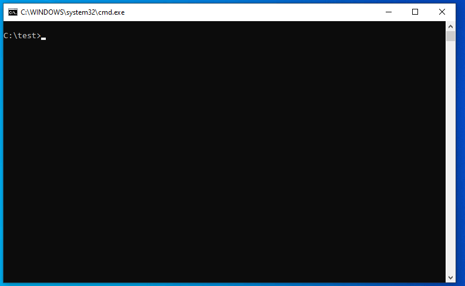

# gsudo - a sudo for Windows

`gsudo` allows to run commands with elevated permissions within the current console. 
It is a `sudo` equivalent for Windows, with a similar user-experience as the original *nix sudo.

Elevated commands are shown in the caller (non-elevated) console. This allows to run elevated commands without switching to another console.

Other `sudo` implementations for windows just fire the requested command in a new elevated console. `gsudo` instead elevates the command in a background hidden process and streams all I/O to the caller's console

Internally when you call `gsudo`, it launches itself elevated as a background process in "service mode". This will open the Windows UAC pop-up. The requested command is then ran by the elevated service and streamed to the user-level console. The service stays running in the background just in case you need to elevate again soon, without another UAC pop-up. The service process shutdowns automatically after idling for 5 minutes.

## Instalation

    choco install gsudo

(requires [Chocolatey](https://chocolatey.org/install))

## Usage

```gsudo```
Opens an elevated CMD in the current console.

```gsudo [command] [arguments]```
Executes the specified command, elevated, and returns.

## Demo



## Features

- Elevated commands are shown in the user-level console, as `*nix sudo` does, instead of opening the command in a new window.
- Does not shows the UAC pop-up every time.
- Suport for CMD commands `gsudo md folder` instead of `gsudo cmd /c md folder` (as `sudo` does)
- Scriptable: 'gsudo' can be used to write scripts that run elevated commands and interpret exit codes. I.e. All I/O is streamed to the invoker console (an can be captured), exit code too (errorlevel). It waits for the command to finish. Also, if invoked from an already elevated console, it will behave transparently.

## Known issues

- This project was made in a few hours. It is more of a Proof of concept at this point. Logging, argument parsing, configurability, are in the backlog.
- Colored outputs from the elevated command are shown in plain white, sorry.
- When you spawn an elevated cmd, the `<TAB>` key auto complete doesn't work as expected.
- Elevating git-bash currently does not work. But Powershell and Cmd does. Under investigation.
- Ctrl-C behaves differently on different situations. Still a work in progress.
- Windows legacy Console (WinPty) is a limited API, which explains most of the issues, and `gsudo` still does not support ConPTY.
